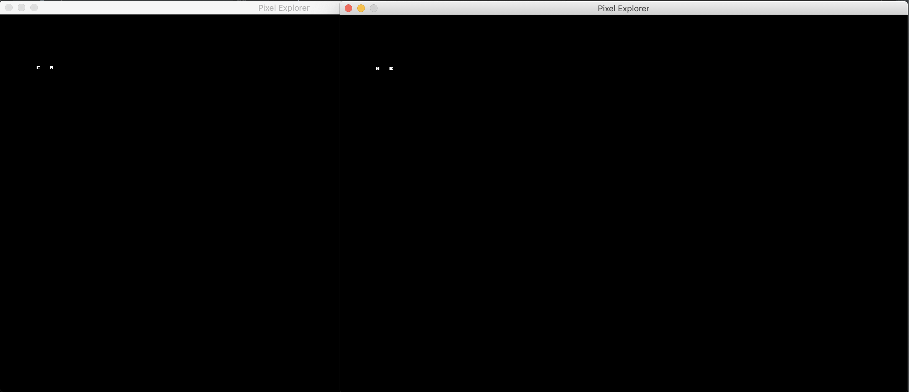
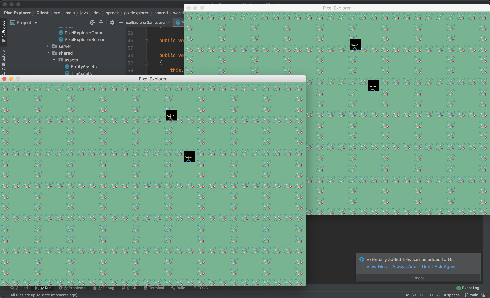
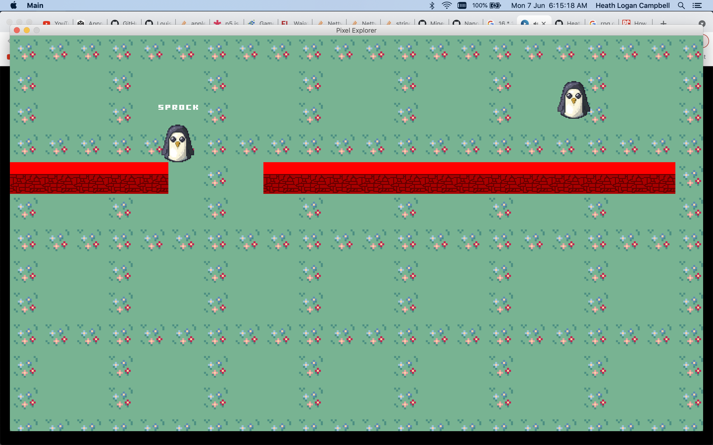

# `PixelExplorer`

## Versions
### v0.0.1 : Play nothing together :) - 17/May/2021 
So far we just have a basic echo server.

How we did this was

We build a new project using maven which is a depency manager
and add netty 4.1 to it, thus allowing us to use netty in our
project. 

We next had to set up a encoder and decoder which simply
are converters from bytes to our data structure we'll used called 
packets. this coders get applied every upload and download.

on one end of the decoder, we have a packethandler which
dispatches our packet to be correctly processed thru the 
PacketListener, where it does a look up by class name of the packet
and runs the respective listener attached to that class.

in our case right now, we only have 1 packet called DummyPacket
which is made up of 2 ints, "Magic Number" just a random number we would
like to send and "Hops" number of times this packet had been sent
back and forth.

So currently, as soon as the client joins the server, it'll
send a DummyPacket which the server will pick up and decode
then print to the console.
##### DummyPacket Code
```java
public class DummyPacket extends Packet
{
    private int magicNumber;
    private int hopCount = 0;

    public DummyPacket(int magicNumber) {
        this.magicNumber = magicNumber;
    }

    public DummyPacket() { }

    public int getHopCount() {
        return hopCount;
    }

    public void setHopCount(int hopCount) {
        this.hopCount = hopCount;
    }

    public int getMagicNumber() {
        return magicNumber;
    }

    @Override
    public int getPacketId() {
        return 0x01;
    }

    @Override
    public void read(ByteBuf in)
    {
        this.magicNumber = in.readInt();
        this.hopCount = in.readInt();
    }

    @Override
    public void write(ByteBuf out)
    {
        out.writeInt(this.magicNumber);
        out.writeInt(this.hopCount);
    }

    @Override
    public String toString() {
        return "DummyPacket{" +
                "magicNumber=" + magicNumber +
                ", hopCount=" + hopCount +
                '}';
    }
}
```

##### DummyPacket Packet Listener
```java
 setListener(DummyPacket.class, packet -> {
            System.out.println("Recieved " + packet.toString());
        });
```

##### Client
```
/Library/Java/JavaVirtualMachines/jdk1.8.0_201.jdk/Contents/Home/bin/java -javaagent:/Applications/IntelliJ IDEA CE.app/Contents/lib/idea_rt.jar=64451:/Applications/IntelliJ IDEA CE.app/Contents/bin -Dfile.encoding=UTF-8 -classpath /Library/Java/JavaVirtualMachines/jdk1.8.0_201.jdk/Contents/Home/jre/lib/charsets.jar:/Library/Java/JavaVirtualMachines/jdk1.8.0_201.jdk/Contents/Home/jre/lib/deploy.jar:/Library/Java/JavaVirtualMachines/jdk1.8.0_201.jdk/Contents/Home/jre/lib/ext/cldrdata.jar:/Library/Java/JavaVirtualMachines/jdk1.8.0_201.jdk/Contents/Home/jre/lib/ext/dnsns.jar:/Library/Java/JavaVirtualMachines/jdk1.8.0_201.jdk/Contents/Home/jre/lib/ext/jaccess.jar:/Library/Java/JavaVirtualMachines/jdk1.8.0_201.jdk/Contents/Home/jre/lib/ext/jfxrt.jar:/Library/Java/JavaVirtualMachines/jdk1.8.0_201.jdk/Contents/Home/jre/lib/ext/localedata.jar:/Library/Java/JavaVirtualMachines/jdk1.8.0_201.jdk/Contents/Home/jre/lib/ext/nashorn.jar:/Library/Java/JavaVirtualMachines/jdk1.8.0_201.jdk/Contents/Home/jre/lib/ext/sunec.jar:/Library/Java/JavaVirtualMachines/jdk1.8.0_201.jdk/Contents/Home/jre/lib/ext/sunjce_provider.jar:/Library/Java/JavaVirtualMachines/jdk1.8.0_201.jdk/Contents/Home/jre/lib/ext/sunpkcs11.jar:/Library/Java/JavaVirtualMachines/jdk1.8.0_201.jdk/Contents/Home/jre/lib/ext/zipfs.jar:/Library/Java/JavaVirtualMachines/jdk1.8.0_201.jdk/Contents/Home/jre/lib/javaws.jar:/Library/Java/JavaVirtualMachines/jdk1.8.0_201.jdk/Contents/Home/jre/lib/jce.jar:/Library/Java/JavaVirtualMachines/jdk1.8.0_201.jdk/Contents/Home/jre/lib/jfr.jar:/Library/Java/JavaVirtualMachines/jdk1.8.0_201.jdk/Contents/Home/jre/lib/jfxswt.jar:/Library/Java/JavaVirtualMachines/jdk1.8.0_201.jdk/Contents/Home/jre/lib/jsse.jar:/Library/Java/JavaVirtualMachines/jdk1.8.0_201.jdk/Contents/Home/jre/lib/management-agent.jar:/Library/Java/JavaVirtualMachines/jdk1.8.0_201.jdk/Contents/Home/jre/lib/plugin.jar:/Library/Java/JavaVirtualMachines/jdk1.8.0_201.jdk/Contents/Home/jre/lib/resources.jar:/Library/Java/JavaVirtualMachines/jdk1.8.0_201.jdk/Contents/Home/jre/lib/rt.jar:/Library/Java/JavaVirtualMachines/jdk1.8.0_201.jdk/Contents/Home/lib/ant-javafx.jar:/Library/Java/JavaVirtualMachines/jdk1.8.0_201.jdk/Contents/Home/lib/dt.jar:/Library/Java/JavaVirtualMachines/jdk1.8.0_201.jdk/Contents/Home/lib/javafx-mx.jar:/Library/Java/JavaVirtualMachines/jdk1.8.0_201.jdk/Contents/Home/lib/jconsole.jar:/Library/Java/JavaVirtualMachines/jdk1.8.0_201.jdk/Contents/Home/lib/packager.jar:/Library/Java/JavaVirtualMachines/jdk1.8.0_201.jdk/Contents/Home/lib/sa-jdi.jar:/Library/Java/JavaVirtualMachines/jdk1.8.0_201.jdk/Contents/Home/lib/tools.jar:/Users/heathlogancampbell/Documents/software/Companies/CobbleSwordV2/PixelExplorer/Client/target/classes:/Users/heathlogancampbell/.m2/repository/io/netty/netty-all/4.1.63.Final/netty-all-4.1.63.Final.jar dev.sprock.pixelexplorer.client.Main
Packet sent
```

##### Server
```
/Library/Java/JavaVirtualMachines/jdk1.8.0_201.jdk/Contents/Home/bin/java -javaagent:/Applications/IntelliJ IDEA CE.app/Contents/lib/idea_rt.jar=64447:/Applications/IntelliJ IDEA CE.app/Contents/bin -Dfile.encoding=UTF-8 -classpath /Library/Java/JavaVirtualMachines/jdk1.8.0_201.jdk/Contents/Home/jre/lib/charsets.jar:/Library/Java/JavaVirtualMachines/jdk1.8.0_201.jdk/Contents/Home/jre/lib/deploy.jar:/Library/Java/JavaVirtualMachines/jdk1.8.0_201.jdk/Contents/Home/jre/lib/ext/cldrdata.jar:/Library/Java/JavaVirtualMachines/jdk1.8.0_201.jdk/Contents/Home/jre/lib/ext/dnsns.jar:/Library/Java/JavaVirtualMachines/jdk1.8.0_201.jdk/Contents/Home/jre/lib/ext/jaccess.jar:/Library/Java/JavaVirtualMachines/jdk1.8.0_201.jdk/Contents/Home/jre/lib/ext/jfxrt.jar:/Library/Java/JavaVirtualMachines/jdk1.8.0_201.jdk/Contents/Home/jre/lib/ext/localedata.jar:/Library/Java/JavaVirtualMachines/jdk1.8.0_201.jdk/Contents/Home/jre/lib/ext/nashorn.jar:/Library/Java/JavaVirtualMachines/jdk1.8.0_201.jdk/Contents/Home/jre/lib/ext/sunec.jar:/Library/Java/JavaVirtualMachines/jdk1.8.0_201.jdk/Contents/Home/jre/lib/ext/sunjce_provider.jar:/Library/Java/JavaVirtualMachines/jdk1.8.0_201.jdk/Contents/Home/jre/lib/ext/sunpkcs11.jar:/Library/Java/JavaVirtualMachines/jdk1.8.0_201.jdk/Contents/Home/jre/lib/ext/zipfs.jar:/Library/Java/JavaVirtualMachines/jdk1.8.0_201.jdk/Contents/Home/jre/lib/javaws.jar:/Library/Java/JavaVirtualMachines/jdk1.8.0_201.jdk/Contents/Home/jre/lib/jce.jar:/Library/Java/JavaVirtualMachines/jdk1.8.0_201.jdk/Contents/Home/jre/lib/jfr.jar:/Library/Java/JavaVirtualMachines/jdk1.8.0_201.jdk/Contents/Home/jre/lib/jfxswt.jar:/Library/Java/JavaVirtualMachines/jdk1.8.0_201.jdk/Contents/Home/jre/lib/jsse.jar:/Library/Java/JavaVirtualMachines/jdk1.8.0_201.jdk/Contents/Home/jre/lib/management-agent.jar:/Library/Java/JavaVirtualMachines/jdk1.8.0_201.jdk/Contents/Home/jre/lib/plugin.jar:/Library/Java/JavaVirtualMachines/jdk1.8.0_201.jdk/Contents/Home/jre/lib/resources.jar:/Library/Java/JavaVirtualMachines/jdk1.8.0_201.jdk/Contents/Home/jre/lib/rt.jar:/Library/Java/JavaVirtualMachines/jdk1.8.0_201.jdk/Contents/Home/lib/ant-javafx.jar:/Library/Java/JavaVirtualMachines/jdk1.8.0_201.jdk/Contents/Home/lib/dt.jar:/Library/Java/JavaVirtualMachines/jdk1.8.0_201.jdk/Contents/Home/lib/javafx-mx.jar:/Library/Java/JavaVirtualMachines/jdk1.8.0_201.jdk/Contents/Home/lib/jconsole.jar:/Library/Java/JavaVirtualMachines/jdk1.8.0_201.jdk/Contents/Home/lib/packager.jar:/Library/Java/JavaVirtualMachines/jdk1.8.0_201.jdk/Contents/Home/lib/sa-jdi.jar:/Library/Java/JavaVirtualMachines/jdk1.8.0_201.jdk/Contents/Home/lib/tools.jar:/Users/heathlogancampbell/Documents/software/Companies/CobbleSwordV2/PixelExplorer/Client/target/classes:/Users/heathlogancampbell/.m2/repository/io/netty/netty-all/4.1.63.Final/netty-all-4.1.63.Final.jar dev.sprock.pixelexplorer.server.Main
Recieved DummyPacket{magicNumber=42, hopCount=0}
```

### v0.0.2 : Player & Entity Object - 19/May/2021
We have no added a very basic login packet and player system.
Which acts different for server and client, since Servers will keep track
of player connections, we do not need that code to be executed for clients
whom will only be actively conected to 1 address, the server.

We also now are using Lombok in this project to lighten up the boilerplate code
Notice below we are using @Getter, @NoArgsConstructor, @AllArgsConstructor which 
at compile time will add getters for all the fields, create a empty constructor and 
a constructor with all the fields. 

Sure, in the future for login, we'll want to authenaticate the user and
what not, but we can do that later. At this point, we would like to
just get 2 players up on the screen then they can see each other move
and talk to each other. hopefully, we can have that functionality done by
the end of the week.
                                                                             
```java
@Getter
@NoArgsConstructor
@AllArgsConstructor
public class LoginPacket extends Packet
{
    private String username;

    @Override
    public int getPacketId()
    {
        return PacketConstants.LOGIN_PACKET_ID;
    }

    @Override
    public void read(ByteBuf in)
    {
        this.username = this.readString(in);
    }

    @Override
    public void write(ByteBuf out)
    {
        this.writeString(out, this.username);
    }
}
``` 

### v0.0.3 : Spawn, Teleport and Destroy - 19/May/2021
We added a way to spawn, teleport and destroy entities.
I'm planning on using these packets for all entities including the player
themselfs, who would be referenced via the entity id 0.

##### Entity Manage Plan
In a world, we'll have a list of entities. These entities
will range from players, animals, monsters and items. which 
mean we'll have to give each one a unique id that's maintanced
across all clients. 

This should be pretty straight forward as we can just have a
hashmap of all entities in <int, entity> so we can have fast look
ups.

as stated before, 0 would refer to the current player.

A problem we are likely to run into tho, is as we spawn more
and more entities in the world, our server will become slower and slower
so to address this problem we should make a regional bucket system. So
We only pick up entities in our near by area. Something like a quad tree 
would work well as [seen in this video](https://www.youtube.com/watch?v=OJxEcs0w_kE&ab_channel=TheCodingTrainTheCodingTrainVerified)
Or a [Spatial Hash Grids](https://www.youtube.com/watch?v=sx4IIQL0x7c)

### v0.0.4 : Netty for only networking - 19/May/2021
We moved the processing packets off the netty for the server
side which will process all the packets only every tick.
thus making our application more thread safe and easier to make
without the fear of race conditions.

### v0.0.5 : Rendering something to the screen - 20/May/2021
We have now attached a rendering engine to the client end, which 
can render a basic scene, It follows a simple set up of breaking 
up the render and update cycles. So we have have more frames than
updates if need be.


### v0.0.6.1 : Controls - 1/June/2021
We added users controls, so that you can control the pixel with `awsd`

### v0.0.6.2 : Two Player - 2/June/2021
We now have the graphical part working so that you can control
pixels individally, linking by the server. Spawning and moving works.
Also the game loop was rewriten so it'll feel more smoother and entities now
use a vector oject.

Also note, packets will be flushed every tick, so that they aren't just flushed on write, thus saving the OI from a lot of unneed work



### v0.0.7 : Simple world generation and bug fixes - 6/June/2021
We have now got tiles rendering on the screen. this is thru
a world object which is made up of chunks (16 x 16 tiles). 
than this is producted by a chunk generation class.

The class below just a basic example, which generates a grass world

```java
public class BasicChunkGenerator extends ChunkGenerator
{
    @Override
    public Chunk generateChunk(int chunkX, int chunkY)
    {
        Chunk chunk = new Chunk(chunkX, chunkY);

        short[] tiles = new short[Chunk.CHUNK_SIZE * Chunk.CHUNK_SIZE];
        Arrays.fill(tiles, (short) 1);

        chunk.setTiles(tiles);

        return chunk;
    }
}
```



### v0.0.8 : Bumper cars - 7/June/2021
We have no added support for solid objects, so that you
can colide into walls. 
as well as 
 * Increased screen size
 * Usernames over player
 * Frame buffering to fix massive index out of bound issue
 * Updated player sprite
 * 8 direction player sprite
 * Simple Chat, only client side 
 
